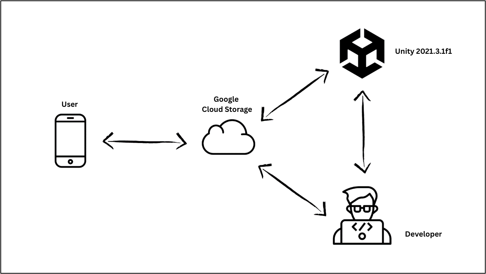

# Space Sync 🏠✨

**An innovative Augmented Reality (AR) application for interior design and furniture placement.**

[](https://unity.com/)
[](https://unity.com/ar)
[](https://github.com)
[](LICENSE)

---

## 📱 Overview

**Space Sync** is a cross-platform AR app built with Unity that redefines how users interact with their physical space. It allows real-time visualization and placement of 3D furniture models in real-world environments, making it ideal for homeowners and interior designers alike.

---

## ✨ Key Features

- **Real-time AR Placement** – Seamlessly position furniture within your real space.
- **Precise Spatial Mapping** – Accurate plane detection on horizontal surfaces.
- **Extensive Furniture Library** – Choose from a variety of 3D models.
- **Intuitive Gesture Controls** – Touch-based rotation, scaling, and movement.
- **Cloud Integration** – Models dynamically loaded from Google Cloud Storage.
- **Offline Mode** – Previously loaded models available without internet.
- **Cross-Platform** – Works on both iOS and Android.

### 🔍 Visual Highlights


<table align="center">
  <tr>
    <td align="center">
      <br/>
      <strong>CROSSHAIR PLACEMENT ON THE FLOOR</strong>
    </td>
    <td align="center">
      <br/>
      <strong>FURNITURE IS PLACED ON THE FLOOR</strong>
    </td>
    <td align="center">
      <br/>
      <strong>MULTIPLE FURNITURE MODELS ARE PLACED</strong>
    </td>
  </tr>
</table>


---

## 🎯 Objectives

- Create an immersive and interactive AR experience.
- Help users visualize layouts before physically purchasing furniture.
- Simplify interior design for both professionals and individuals.

---

## 🏗️ Architecture

<p align="center">
  
</p>

- **Unity App**: AR Engine using Unity and AR Foundation.
- **Cloud Storage**: Furniture models hosted in Google Cloud Storage.
- **Local Cache**: Offline support using locally stored models.
- **User Device**: Mobile phones/tablets with AR capabilities.

---

## 🛠️ Tech Stack

- **Unity 2021.3.1f1**
- **AR Foundation, ARCore, ARKit**
- **C#**
- **Google Cloud Storage**
- **LiDAR / Depth Sensing** (for enhanced surface detection)

---

## 🚀 Getting Started

### Prerequisites

- Unity Hub + Unity 2021.3.1f1
- AR-capable device (iOS 11+ / Android 7.0+)
- Google Cloud credentials for model access

### Installation Steps

1. **Clone the Repository**
   ```bash
   git clone https://github.com/yourusername/space-sync.git
   cd space-sync
   ```

2. **Open in Unity Hub**

3. **Install AR Dependencies**
   - AR Foundation
   - ARKit (for iOS)
   - ARCore (for Android)

4. **Set Build Target**
   - Switch the platform to iOS or Android in **File > Build Settings**
   - Enable XR settings for AR support

---

  ### 📲 App Workflow

- **Launch the app** and scan the environment.
- **Select furniture** from the catalog.
- **Tap to place** objects on detected surfaces.
- **Use gestures** to interact (rotate, move, scale).
- **Walk around** for 360° viewing.

---

### 🧠 Key Scripts

| Script                 | Function                                |
|------------------------|------------------------------------------|
| `ARPlaneDetection.cs`  | Detects horizontal planes                |
| `FurniturePlacement.cs`| Places and manages objects               |
| `CloudIntegration.cs`  | Loads models from Google Cloud           |
| `UIManager.cs`         | Handles interface logic                  |

---
### 🚧 Challenges & Solutions

| Challenge               | Solution                                  |
|-------------------------|-------------------------------------------|
| Accurate AR Detection   | Enhanced algorithms for surface tracking  |
| Device Compatibility    | Tested on various AR-enabled devices      |
| Offline Functionality   | Implemented local model caching           |
| Model Updates           | Cloud-based dynamic loading               |


